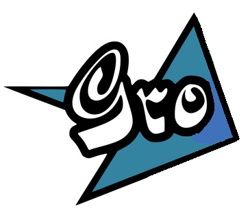

## What Gro Is

Gro is both a syntax that extends that of Go, and a tool that generates Go code from Gro.

Gro adds some extra Ascii keywords to Go's syntax, at both the top and statement levels, to give extra functionality. Gro also uses single Unihan characters as optional substitutes for keywords, special identifiers, and common package names, and as the names for hygienic macros. It does so by introducing one small prohibition to Go's syntax: prohibiting the use of Unihan in identifier names. Because every Unihan has an implied space both before and after it in the Gro grammar, using Unihan enables Gro source code to not have any whitespace, just as using semicolons enables Go code not to have any newlines.

Gro code and Unihan-free Go code can be mixed freely in the same source file. But when a program is written using Unihan in all the places it can be in the code, any of the 25 Go keywords can be used as identifier or label names, so a dedicated Gro programmer doesn't need to know any Go-specific naming exceptions to write Gro code. The Unihan, unlike other non-Ascii characters, are easily enterable via the many IME's (input method editors) available for Chinese that ship for free on OS's such as Linux and Windows, so Gro code can be typed in quickly.

# Spec

## Spaceless Programming

It's possible to write any valid Gro program without any whitespace, e.g:

	包正;种A整;功正(){a:=123;形Println(整64(a));变b这A;变c这A;形Println(b,c)}
	//example of totally spaceless code (except this comment)

To achieve code without whitespace, we must use some extra tokens such as 这("this").

## Unihan aliases for keywords

Various single Unihan are used as aliases for Go's keywords, special identifiers, and certain package names in the Gro grammar. Each Unihan has an implied space both before and after it so the spaces needn't be written.

The 25 keywords of Go can be substituted by any of their respective Unihan below:

* 包 `package`, 入 `import`, 变 `var`, 久 `const`, 种 `type`, 功 `func`
* 构 `struct`, 图 `map`, 面 `interface`, 通 `chan`
* 考 `switch`, 选 `select`, 事 `case`, 别 `default`, 掉 `fallthrough`
* 如 `if`, 否 `else`, 为 `for`, 围 `range`
* 去 `go`, 终 `defer`, 回 `return`, 破 `break`, 继 `continue`, 跳 `goto`

So we can write Gro code using keyword aliases:

	包正 //包 is short for "package" with an implied space after it
		//正 is short for identifier "main" which is required here
	入"fmt" //入 is short for "import"

	//功 is short for "func", and 正 for identifier "main" which is required here
	功正(){
		fmt.Println("你好,世界")
	}

## Unihan aliases for special identifiers

The 39 special identifiers in Go can also be substituted by their associated Unihan:

* 真 `true`, 假 `false`, 空 `nil`, 毫 `iota`
* 双 `bool`, 节 `byte`, 字 `rune`, 串 `string`, 错 `error`, 镇 `uintptr`
* 整 `int`, 整8 `int8`, 整16 `int16`, 整32 `int32`, 整64 `int64`
* 绝 `uint`, 绝8 `uint8`, 绝16 `uint16`, 绝32 `uint32`, 绝64 `uint64`
* 漂32 `float32`, 漂64 `float64`, 复 `complex`, 复64 `complex64`, 复128 `complex128`
* 造 `make`, 新 `new`, 关 `close`, 删 `delete`, 能 `cap`, 度 `len`, 加 `append`, 副 `copy`
* 实 `real`, 虚 `imag`, 丢 `panic`, 抓 `recover`, 写 `print`, 线 `println`

The ones suffixed with a number have special support in the grammar, and are the only cases in Gro of Unihan having extra tokens associated with them.

As well as Go aliases `byte`(节) and `rune`(字), Gro adds alias 任 for `interface{}`, best verbalized as "any".

	package main
	import("fmt")
	//we use 整 for "int" and 漂64 for "float64"...
	功plus(a整,b整)漂64{回漂64(a+b)} //回 for "return"
	func main(){
		a:= 复(0, plus(4,6))
		fmt.Println("a is: ", a)
	}

## Unihan aliases for package names

We also enable Unihan aliases for package names, and they aren't followed by a dot when used. Only 6 packages are implemented for now:

* 形 `fmt`, 网 `net`, 序 `sort`, 数 `math`, 大 `math/big`, 时 `time`

When a package name is aliased by a Unihan, it needn't and mustn't be explicitly imported.

	包正;功正(){
		//形 is short for "fmt." which is automatically imported when used
		形Println("你好,世界")
	}

More packages will progressively be added over time.

## Embedding Go code in Gro

There are one or two syntactic restrictions on Go code that can be embedded in Gro.

### No Unihan in identifier names

The use of Unihan in identifier names is prohibited in the Gro grammar. So `myName` is valid in both Go and Gro, but `my名` and `性名` are invalid in Gro. Virtually no-one uses Unihan in identifiers anyway, only inside strings and comments, so in practise this shouldn't be a problem for anyone wanting to program in Gro. But when Unihan is required in a name, use 引, e.g. `引"X世界"` to represent `X世界`.

By putting `syntax "go"` at the top of the `.gro` file, Go code following this restriction can be embedded within Gro. Many extra Ascii keywords such as `source` can be mixed in at the top-level along with the Go-specific `package`, `import`, `const`, `type`, `var` and `func`.

### No keywordless statements

A further second restriction applies if Go code is to be embedded without the `syntax "go"` line. All statements must have a keyword. Typically keywordless statements can have `do` placed in front of them.

	do a := 123
	do callMe(a)

Because of this restriction, many extra Ascii keywords such as `do` and `assert` can be mixed in at the top-level along with the Go-specific ones such as `for` and `switch`.

## IME-friendly

Because the tokens used by Gro involves toggling between Ascii and Unihan modes in IME's, Gro allows these extra keys `“”‘’（）【】《》！；：，。` in the grammar, as well as their usual Ascii equivalents.

## Go and Gro code can be mixed

Code conforming to the Unihan-free Go grammar and that conforming to the Gro grammar can be mixed easily. Gro code is embedded in Go code simply by using the Unihan alias of the keyword or special identifier at the head of the scope, or using special Unihan 做, best verbalized as "do", at the head of a block. Go code is embedded in Gro code by using special Unihan 英, best verbalized as "ascii", at the head of a block.

Whereas Go's `x:=` means at least one of the lefthand variables must be new, the `做x:=` declaration causes all lefthand variables to be new by creating a new implied block until the end of the explicit block, if necessary shadowing a similarly named identifier in an outer block or previously in the same block. Therefore, the 做(`do`) command allows zero new variables on the `:=`. Both `:=` and `做:=` can take multiple expressions separated by `,` on lefthand and righthand sides.

To understand the details, we must first understand the categories of identifier in Go and in Gro. Just as Go has 3 categories of identifier, i.e. global (the 25 keywords and 39 special identifiers), public (uppercase-initial identifiers), and private (all identifiers beginning with an underscore or lowercase letter, except the 25 keywords), so Gro also has 3 categories. The categories of identifier in Gro match more intuitively to their lexical class, however. They are:

* Unihan. All single-token Unihan which are aliases for keywords, special identifiers, and package names.

* public. Uppercase-initial identifiers are visible outside a package in Gro, just like in Go. They have the same format as in Go.

* protected. Identifiers that begin with an underscore followed by lowercase. They are accessible by both Gro and Go code within a single file. When defined or used within Gro code (i.e. within the static scope of a Unihan), the initial underscore is omitted.

Go's private identifiers are inaccessible within Gro code, which generally isn't a problem because they're usually used as parameters and local variables. If a private variable needs to be accessed by both Go and Gro code, put an underscore in front of it when declaring it in Go context.

The identifier `main` can't have an underscore in front of it in the generated Go code, so we provide the built-in Unihan 正 as an alias to `main` to use with 包(`package`) and 功(`func`). We also provide 开 as an alias to `init`.

We can see how Go code and Gro code is easily mixed:

	//Go by Example: Collection Functions

	package正 //Go code headed by ascii "package"
	入"strings" //Gro code headed by Unihan 入: translated to: import _strings "strings"
	import"fmt" //Go code

	功正(){ //Gro code headed by 功, so all identifiers within have underscore prefixed
		变strs=[]串{"peach","apple","pear","plum"} //"_strs" is actually generated
		形Println(Index(strs,"pear"))
		if 真{ 形Println(Include(strs,"grape")) }
		英{ //Go code embedded within Gro -- signified by 英
			形Println(Any(_strs,功(v串)双{ //referencing Gro-defined identifier from Go code, so prefix _
			回strings.HasPrefix(v,"p")
			}))

			var strs = []string{"peach", "apple", "pear", "plum"} //"strs" generated
			fmt.Println(Index(strs, "pear"))
			fmt.Println(Include(strs, "grape"))
			fmt.Println(Any(strs, func(v string) bool {
				//referencing Go-defined package identifier from Gro -- must prefix underscore...
				return _strings.HasPrefix(v, "p")
			}))
		}
	}

	//We can translate public functions to Gro...
	功Include(vs[]串,t串)双{回Index(vs,t)>=0}

	功Any(vs[]串,f功(串)双)双{
		为_,v:=围vs{如f(v){回真}}
		回假
	}

	//...or we can leave function defn unchanged and everything still just works
	func Index(vs []string, t string) int {
		for i, v := range vs {
			if v == t {
				return i
			}
		}
		return -1
	}

It is good style, though, to use either Go or Gro but not both as much as possible in a single file. Being able to mix both helps with gradual conversions of code from one syntax to the other.

The rules for Unihan acting as a header for Gro code are:

* 包(`package`) heads everything after it in the package
* 入(`import`), 变(`var`), 久(`const`), 种(`type`) each head everything they define
* 功(`func`) heads everything in the receiver, parameters, results, and block after it
* 构(`struct`), 图(`map`), 面(`interface`), 通(`chan`) each head the types and literal data after them, as also do slices and arrays
* 考(`switch`), 如(`if`), 否(`else`), 为(`for`), 选(`select`), 去(`go`), 终(`defer`) each head everything up to the end of the following block
* 事(`case`), 别(`default`) each head the block of statements afterwards
* 围(`range`), 回(`return`) each head the expression immediately following it
* 破(`break`), 继(`continue`), 跳(`goto`) each head any labels that follow them
* 36 special identifiers, except 真(`true`), 假(`false`), 空(`nil`), 毫(`iota`) head the expression they convert in a type conversion
* 任("any") head the expression it converts in a type expression

## Keywords are identifiers within Gro

Because keywords are identifiers within Gro, all possible lowercase-initial identifiers, including Go keywords, are permitted there.

Gro code permits all possible identifiers beginning with a lowercase letter, including all 25 keywords. It does this by automatically putting an underscore at the front of all lowercase-initial identifiers. Such an identifier referenced by surrounding or embedded Go code must explicitly have the initial underscore. Special identifier 做 is available to optionally head declarations and assignments, and even required when an identifier that doubles as a Go keyword is used.

	包正;功正(){
		//added to demo 做:
		做range:="abc" //when used with 做, Go keywords like "range" can be used as identifiers...
		做range="abcdefg" //...and this style should be the prefered style for Gro programmers
		形Printf("range: %v\n",range)
	}

## Special identifier Unicode are protected

Go only has 25 reserved words which can't be used as variables, but all the special identifiers such as `false` can be. Unihan used as special identifiers in Gro can't be locally declared and assigned to as they can in Go:

	package main
	func main() {
		a:= true
		b:= 真 //Unihan for "true" used on right-hand side
		nil:= true //Gro still allows special identifiers (here, "nil") to be used on the left-hand side, ...
		iota:= 真
		//假:= true // ... but when the Unihan version is used, e.g. 假 for false,
				// generates a parse error "expected non-Unihan special identifier on left hand side"
		形Printf("a: %v, b: %v, nil: %v, iota: %v\n", a, b, nil, iota)

		abc:=图[双]整{}
		abc[真]=789 //of course, Unihan can still be on the LHS when not being assigned to
	}

## Packages can be aliased with Unihan

A package not in the registry of Unihan-aliased packages can be given a temporary Unihan when imported. The Unihan is any of those with the 口 radical on the left hand side. There's about 2000 such Unihan to choose from out of the 80,000 in Unicode. Types defined in the current package can be prefixed with 这, best verbalized as "this", if desired.

	package main

	入"fmt"
	import 吧"fmt" //we can use any Unihan with 口-radical on LHS...
	import 哪_fg"fmt" //...with imports that don't have their own dedicated Unihan
	入㕤hij"fmt"
	入卟"unicode/utf8"
	入吗嗎kl"unicode/utf8" //can even put in two aliases

	type A int
	变n = 50
	功正(){
		var b A
		var c这A //can use "这" with locally-defined type to achieve spaceless program
		形Println(b, c)

		如假{
			fg.Printf("Len: %d\n", 度("hijk") + n)
		}否{
			hij.Printf("Len: %d\n", 度("hi") + n)
		}
		fr,_:= utf8.DecodeRune([]节("lmnop"))
		fmt.Printf("1st rune: %s; Len: %d\n", 串(fr), 度("lmnop") + n)
		做_,_=吗DecodeRune([]节("lmnop"))
		㕤Printf("Fifty: %d\n", n)
		哪Printf("Fifty: %d\n", n)
		吧Printf("Fifty: %d\n", n)
	}

## Alternative to inconsistent use of pointer syntax

Many who first encounter pointers in Go, having never used C or C++, find the syntax inconsistent because it follows that of C for expressions, but that of Pascal for declarations. Declaring `v *T` means we can write `*v` as an expression, so the use of token `*` is synchronized for both these uses, but we must vocalize the `*` in our head differently:

* `*T` vocalizes as "pointer to something of type T"
* `*v` vocalizes as "that pointed to by variable v"
* `&v` vocalizes as "pointer to variable v"

So our thought process when we see `*` often is: If it's in a type, say "pointer to", otherwise say the opposite of "pointer to", i.e. "that pointed to by". This inconsistency can be eliminated in Gro by using 尖 for pointer-to in type definitions.

## Multisource packages and multipackaging

The code from a single package in a Gro file can be distributed among many Go source files by using many Gro-specific 源 (or `source`) declarations. As well, a single Gro file can contain the code for many packages, by using many 包 (or `package`) declarations in the same `.gro` file.

If the 包(`package`) declaration is missing from the top of the `.gro` file, the package is inferred to be `main` and a `// +build ignore` directive is placed before it in the `.go` file that's output. If the 源(`source`) declaration is missing, the source is the same name as the `.gro` source file name, except with suffix `.go` instead. So if the Gro source file is called `suppliedName.gro`, the output file for code written within missing 包(`package`) and 源(`source`) declarations will be `suppliedName.go`. The same occurs when the package is explicitly specified as `main` (i.e. `package main`, `package正`, `包main` or `包正`).

A 源(`source`) declaration followed by a string (e.g. `源"myfile"` or `source "myfile"`) puts the code following it into a generated `.go` file with the name specified in the string, with `.go` added. If the 源(`source`) command is missing, the source file will have the same name as the package, with `.go` appended. So for `package hi`, any code appearing before the first 源(`source`) declaration will go into a file called `hi.go`.

Of course, although Gro allows us to generate more than one non-main package in the same directory, Go won't compile it. But Gro does enable us to put each different generated package into a different directory. By specifying a string before the identifier in a 包(`package`) declaration, e.g. `包"someDir"thinking`, the implicit source and explicitly specified sources for `package thinking` will be put into directory `someDir\`. We can also specify a multi-directory path, e.g. `包"lets/wave"bye` or `package "lets/wave" bye`.

Gro also provides 包(`package`) declarations with only a string specified, e.g. `包"oneLib/hi"` or `package "oneLib/hi"`. This is equivalent to `package "oneLib/hi" hi`, so the inferred `.go` file is `oneLib/hi/hi.go` and the explicitly specified file for `source "drop"` is `oneLib/hi/drop.go`.

Gro thus converts a single `.gro` file into a directory structure of `.go` files. For example, this `.gro` file called `myfile.gro`:

	//some decls and stmts here; will create source `myfile.go` with `package main`

	包正 //`package main` contains two explicit sources
	源"tiful" // 1st source `tiful.go`; line could also be `source "tiful"`
	源"beau" // 2nd source `beau.go`

	包hi //`package hi` contains one implied source, called `hi.go`
	//some decls and stmts here

	包thinking //one implied source, `thinking.go`, and one explicit source, `psyche.go`
	//some decls and stmts here
	源"psyche"

	包bye //one explicit source, `booyah.go`
	源"booyah"

	包"someDir"thinking //`package thinking` has one implied source, `someDir/thinking.go`", and one explicit source, `someDir/psyche.go`
	//some decls and stmts here
	源"psyche"

	包"lets/wave"bye //`package bye` has one explicit source, `lets/wave/booyah.go`
	源"booyah"

	包"oneLib/hi" //`package hi` has one implied source, `oneLib/hi/hi.go`
	//some decls and stmts here

will generate:

	currdir
	  +--tiful.go (`package main` with `// +build ignore`)
	  +--beau.go (`package main` with `// +build ignore`)
	  +--hi.go (`package hi`)
	  +--thinking.go (`package thinking`)
	  +--psyche.go (`package thinking`)
	  +--booyah.go (`package bye`)
	  +--someDir/
	  |    +--thinking.go (`package thinking`)
	  |    +--psyche.go (`package thinking`)
	  +--lets/
	  |    +wave/
	  |       +--booyah.go (`package bye`)
	  +--oneLib/
	       +hi/
	          +--hi.go (`package hi`)

Note if the 源(`source`) declaration is missing in a file called `myfile.gro`, the generated source file will be `myfile.go` only when the first package command is missing and inferred to be `package main`. A specified package with an inferred source will be called `main.go`.

Imports in one package can refer to generated packages elsewhere in a single `.gro` file.

Although one purpose of Gro is to enable all source for all packages to be in one `.gro` file, especially in the earlier exploratory stages of writing a program, it's also easy to split the source into separate files later when needed.

## Implied main functions

If there's code beginning with a statement or a label contained within the declarations that begin with 变(`var`), 久(`const`), 种(`type`) and 功(`func`), they are enveloped within an inferred `func main()`.  Any `type`, `var`, and `const` declarations mixed in with such statements will still be interpreted as having package scope, and will be placed at the top level. To include such declarations with the statements for wrapping within `func main()`, use Go's `_:` label.

Such standalone statements will go into the `func main()` in the order they appear in the source.

It's a common idiom to write a quick script consisting only of statements, which will be wrapped inside `func main()`, given package name `main`, and put in file `main.go`. Because the `gro execute` command runs the `main.go` file after preparing the given `.gro` file, such statement-only code can be run with `gro execute`. Such statements can act as build code for packages following it in the same `.gro` file, though because of Go's simple builds, that's usually not necessary.

Because the `package main`, `source "myfile.go"` and `func main()` lines are all optional, we can write single-line scripts in Gro:

	形Println("abc", 789)

# Examples

Most of the Go examples from `gobyexample.com` (or its Chinese translation `gobyexample.everyx.in` ) are available as Gro source in `github.com/grolang/samples/gro`, all except the last few. (*Go By Example* is copyrighted by Mark McGranaghan.)

For example, the code from the first 3 pages of *Go by Example* can be replaced by the terser:

	包正 //包 is shorthand Unihan for "package"; 正 is short for "main"
	久s串="constant" //久 short for "const"
	功正(){ //功 short for "func"

		//Go by Example: Hello world
		//形 is short for "fmt." which is automatically imported when used
		形Println("你好,世界")

		//Go by Example: Values
		形Println("go"+"lang") //Canonical "spaceless" Gro style: no spaces within statements and expressions
		形Println("1+1 =",1+1)
		形Println("7.0/3.0 =",7.0/3.0)
		形Println(真&&假) //真 for "true"; 假 for "false"
		形Println(真||假)
		形Println(!真)

		//Go by Example: Variables
		做{ //optionally, begin standalone block with "做"
			变a串= "initial";形Println(a) //变 for "var"; 串 for "string"
			变b,c整=1,2;形Println(b, c) //整 for "int"
			变d=真;形Println(d)
			变e整;形Println(e)
			f:="short";形Println(f)
			//canonical Gro style: join stmts on one line with semicolons if they're written
			//as separate lines between blank lines in corresponding Go style
		}
	}
	功plus(a整,b整)整{回a+b} //回 for "return"
	功plusPlus(a,b,c整)整{回a+b+c}

If we shorten the local identifier names, and use semicolon (`;`) to join lines together, we can achieve much greater tersity.

# Keywords

## Package keyword

包 is an alias for the package header, and has many forms:

    包mypkg            //defines package with specified name just like in Go
    包正               //正 is an alias for "main"
    包                 //package name "main" is used as default
    包"oneLib/hi"      //defines package hi, and uses oneLib/hi as base location for source files
    包"someDir"thinking //defines package thinking, and uses someDir as base location for source files

A single `.gro` file can contain more than one 包(`package`) header. When it's missing at the top, package `main` is used.

Each package statement may have one of more source statements, with the package name followed by `.go` used if it's missing. It has form:

    源"xyz"            //defines source file "xyz.go" within package
    源                 //defines source with same name as package name, but with ".go" appended

A special case is inferred `package main` infers the `.go` filename based on the containing `.gro` filename, so `myfile.gro` will create `myfile.go`.

Each package in a `.gro` file can contain more than one 源(`source`) header.

## Import keyword

The 入(`import`) statement has many forms, and cause the public members of the imported package to be available in the importing one.
Some forms are the same as in Go:

    入"abc/defg"        //makes members available if qualified with last segment and dot, e.g. defg.Member
    入hij"fmt"          //accepts identifier as alias, just like in Go
    入."xyz"            //accepts dot form, just like in Go
    入卟"unicode/utf8"  //accepts 口-radical Unihan as alias
    入㕤hij"fmt"        //accepts both Ascii and Unihan aliases
    入叨叩kl"unicode/utf8" //accepts more than one Unihan alias
    入("math/rand";"sync/atomic") //accepts parenthesized forms

## Assert keyword

An `assert` keyword, aliased by 对, is available.

## Commands in Gro file

We can put certain commands, such as Go's `run`, Gro's `prepare` and Gro's `execute`, inside a Gro file as statements.

# Tentative Features

## Package Aliasing

Packages defined within a `.gro` file can also be aliased with Unihan. Use `包吧thinking`, or `包"someDir"吧thinking` if the directory is specified.

TODO: Packages can be pre-declared with the 预 Unihan. Put `预吧thinking` at the top level somewhere before its first use, followed up with `包"someDir"thinking` at the package definition.

There are thus 3 ways to use packages in Gro:

* use the globally known Unihan alias, e.g. 形 for `fmt`
* import it explicitly at the top of the source just like in Go
* define it in the same source file

## Syntactic macros

Gro brings hygienic macros to Go. The 2 ways to use macros are:

* use a globally known Unihan alias
* import it explicitly from another directory at the top of the source

Besides the Unihan for Go keywords and special identifiers, there are many more that can be used for defining statements, built-in functions, and built-in types, and they are specified with macros.

Such macros with Ascii names (e.g. `run`, `test`) called the same way as statements (e.g. `for`, `if`). Some of these are 准, 跑 and 执, used for building Go and Gro source files:

* `准"src/github.com/grolang/samples/goByEg4.gro"` runs the `gro prepare` command
* `跑"src/github.com/grolang/samples/goByEg4.go"` runs the `go run` command
* `执"src/github.com/grolang/samples/goByEg4.gro"` runs to `gro execute` command, i.e. both `gro prepare` and `go run`

The 用(`use`) command is for importing a macro for use in a package. It must be used with a temporary Unihan, any with the 口 radical on the left. The macro Unihan could be used like a statement keyword, a built-in function name, or a built-in type name.

	用㕧"github.com/grolang/samples/moremacs" //before the package; directory must be used
	用㕨"github.com/grolang/samples/somemacs"
	包正       //package
	源"hey"    //源(source)
	入"fmt"    //import
	种A整;     //type
	功正(){    //func main()
		㕧a:=9 //macro could head a statement
		㕧{    //macro could enclose a block
			a=123
		}
		fmt.Println(㕨(a)) //macro could act like a builtin function
	}

TODO: Macros as Statements:

Macro syntax should follow the syntactic style of elements already in the Go language. For statements, they typically begin with a keyword, e.g. 为(`for`) or 去(`go`), perhaps followed by an expression, e.g. 回(`abc`), then perhaps a curly-enclosed block. Perhaps there's many semicolon-separated expressions or simple statements, (e.g. `为i:=0;i<10;i++{}`) before the curlies, or perhaps there's many statements following (e.g. case's `事789: f(x); g(y); h(z)`). Perhaps another keyword follows the curlies (e.g. if-else's `如a==b{回1}否{回2}`).

Optional Unihan 做(`do`) and 叫("call") help bring consistency to this syntactic style.

TODO: Macros as Built-in Expressions:

Built-in expressions typically begin with a function name followed by other expressions or types within parens (e.g. append's `加(x,a,b)`). Sometimes the parens are omitted (e.g. range's `围x`), empty (e.g. recover's `抓()`), or both, e.g. 毫(`iota`). Because Gro's Unihan syntax blurs the line between keywords and special identifiers, `range` is considered a built-in expression.

TODO: Macros as Built-in Types:

Built-in types typically begin with a name, e.g. 串(`string`), and can be followed by brackets (e.g. map's `图[X]Y`), curlies (e.g. struct's `构{X节}`), a number (e.g. int's `整8`), or something even more complicated (e.g. func's `功(串)双`).

Optional Unihan 这 for same-package names helps bring consistency to this syntactic style. (TODO: Optional Unihan 切 for slices and arrays also helps this.)

